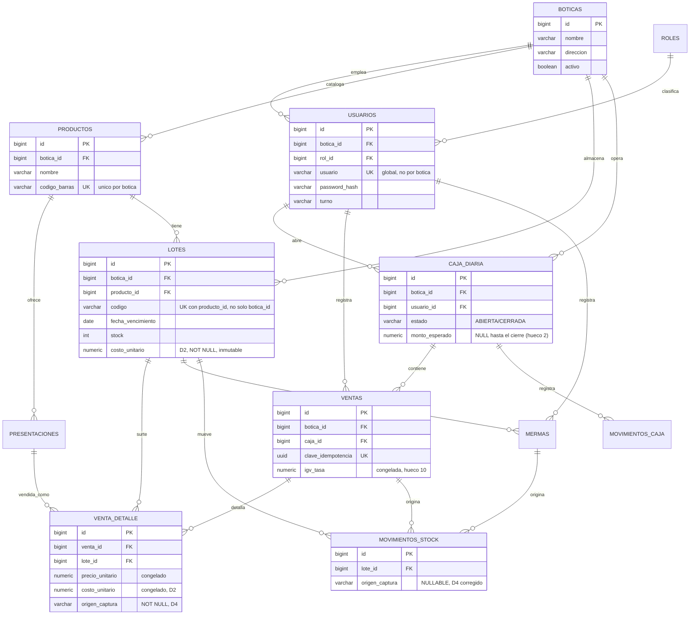

# Modelo de datos

17 tablas (12 núcleo + 5 futuro), Flyway `V1__esquema.sql` +
`V2__seed.sql` en `backend/src/main/resources/db/migration/`. El guion
original decía "16 entidades" pero listaba 17 nombres — se corrigió el
rótulo, no la lista (`docs/prompts/PROMPT-AGENTE-BACKEND-QA.md`).

Decisiones que dan forma a este esquema, con su alternativa descartada:
`docs/DECISIONES.md` (D1 multi-botica, D2 costo/ganancia, D4 origen de
captura). Contrato de API que consume estas tablas: `docs/API-CONTRATO.md`.

## Diagrama (núcleo, Fase 1)

Las tablas futuras (Fase 2/3) no llevan sus columnas en el diagrama —
son mínimas y están mejor descritas en la tabla más abajo.

## Tablas

| Tabla | Fase | Columnas clave | Para qué sirve |
|---|---|---|---|
| `boticas` | 1 | `nombre`, `direccion`, `ruc`, `activo` | Cada botica independiente (D1). Todo dato operativo cuelga de una. |
| `roles` | 1 | `nombre` (`TECNICO`\|`ADMINISTRADOR`) | Catálogo global, no varía por botica. |
| `usuarios` | 1 | `botica_id`, `rol_id`, `usuario` (único global), `password_hash`, `turno` | Personal de una botica. El login no pide botica: se resuelve desde el usuario. |
| `productos` | 1 | `botica_id`, `codigo_barras` (único por botica) | Catálogo por botica — el mismo código de barras puede repetirse en dos boticas como productos distintos. |
| `presentaciones` | 1 | `producto_id`, `factor_conversion`, `precio` | Formas vendibles (caja/blíster/unidad). `botica_id` redundante con `productos.botica_id`, incluido explícito por D1. |
| `lotes` | 1 | `producto_id`, `codigo` (único con `producto_id`, no solo con `botica_id`), `fecha_vencimiento`, `stock`, `costo_unitario` | Lote físico en stock. Sin columna de precio de venta — ver `presentaciones`. `costo_unitario` (D2) se captura una vez, no se edita. Índice FEFO: `(botica_id, producto_id, fecha_vencimiento)`. |
| `caja_diaria` | 1 | `usuario_id`, `turno`, `fecha`, `estado`, `monto_esperado` | Una caja por usuario/turno/día (índice único parcial). `monto_esperado`/`diferencia`/`semaforo_descuadre` quedan `NULL` mientras está `ABIERTA` — conteo ciego (hueco 2). |
| `ventas` | 1 | `caja_id`, `clave_idempotencia` (única), `igv_tasa` | Cabecera de venta. `clave_idempotencia` la genera el frontend al confirmar el carrito. `igv_tasa` congela la tasa vigente (hueco 10). |
| `venta_detalle` | 1 | `venta_id`, `lote_id`, `precio_unitario`, `costo_unitario`, `origen_captura` | Una fila por lote consumido — FEFO puede repartir una línea del carrito entre varios lotes. Precio y costo van congelados. `origen_captura` `NOT NULL` (D4). |
| `caja_diaria` / `movimientos_caja` | 1 | `caja_id`, `tipo` (incl. `EGRESO`), `monto` (puede ser negativo) | Ledger de caja. `afecta_efectivo=false` en mermas y ventas Yape/tarjeta. |
| `mermas` | 1 | `lote_id`, `usuario_id`, `motivo`, `valor_venta` | Baja de stock. `valor_venta` (nota 3, nunca "valor" a secas) es a precio de venta — el costo se calcula en el reporte de Fase 2 vía `JOIN` a `lotes.costo_unitario`, sin columna propia. |
| `movimientos_stock` | 1 | `lote_id`, `tipo`, `cantidad` (con signo), `origen_captura` | Ledger de stock. `origen_captura` `NULLABLE` (D4, corregido): `NULL` en las filas que genera una merma — no se inventa un valor de conveniencia. |
| `clientes` | 2 | `nombre`, `documento` | Clientes frecuentes / historial de compra. Sin endpoint todavía. |
| `comprobantes_electronicos` | 3 | `venta_id`, `tipo`, `estado` | Comprobante tributario SUNAT — distinto del reporte de resultados interno (D3, no confundir los términos). Endpoint futuro: `POST /api/comprobantes`. |
| `kardex` | 2 | `producto_id` | Kardex valorizado por producto, consolidado desde `movimientos_stock`. Endpoint futuro: `GET /api/kardex`. |
| `reportes_digemid` | 3 | `periodo` | Reporte periódico DIGEMID. Endpoint futuro: `GET /api/reportes/digemid`. |
| `lotes_fraccionados` | 2 | `lote_id`, `unidades_fraccionadas` | Venta fraccionada de un blíster/caja abierto. Endpoint futuro: `PATCH /api/lotes/{id}/fraccionar`. |

## Decisiones de diseño no obvias

- **`estado` (`ABIERTA`/`CERRADA`) en `caja_diaria`, no `abierta boolean`.**
  El contrato JSON expone un booleano (`abierta: true`); la tabla usa un
  `VARCHAR` con `CHECK`, tal como pedía el guion original de la Tarea 7.
  La traducción es responsabilidad del `RowMapper`/Service — anotado acá
  para que no sorprenda a quien escriba el DAO en la Tarea 8.
- **Auditoría (Regla 9) aplicada sin duplicar.** `creado_en`/`creado_por`
  se agregan donde la tabla no tiene ya una columna de negocio que
  responda "quién" (`ventas.usuario_id`, `caja_diaria.usuario_id`,
  `mermas.usuario_id` ya cumplen ese rol — no se duplica con un
  `creado_por` que valdría exactamente lo mismo). `movimientos_caja` y
  `movimientos_stock` sí llevan ambas columnas: no tienen ninguna otra
  forma de registrar quién y cuándo.
- **`usuarios.usuario` es único globalmente, no por botica.** El login
  (`POST /api/auth/login`) no pide elegir botica — si el mismo handle
  pudiera repetirse en dos boticas, el login sería ambiguo sin un
  selector que el formulario no tiene.
- **`movimientos_caja.monto` no tiene `CHECK >= 0`**, a diferencia de
  las demás columnas de dinero: los egresos se guardan como monto
  negativo (mismo convenio que ya usa el mock del frontend).
- **El precio de venta es de `presentaciones`, nunca de `lotes`.** La
  fila con `factor_conversion = 1` ("Unidad") es el precio por unidad
  base del producto; no cambia por reposición, a diferencia del costo.
  `lotes` no tiene columna de precio. Detalle y el bug que esto
  corrigió (Merma valorizando con el precio de la Caja en vez del de
  la Unidad): `docs/DECISIONES.md`, revisión de esquema 2026-09-08.
- **`lotes` es único por `(botica_id, producto_id, codigo)`, no por
  `(botica_id, codigo)`.** El código lo asigna el laboratorio: dos
  productos de fabricantes distintos pueden compartirlo. El seed tiene
  un caso deliberado de esto (`LAB-COMPARTIDO-01` en dos productos de
  Botica San Lucas).
- **Todas las columnas de fecha+hora son `TIMESTAMPTZ`, nunca
  `TIMESTAMP` simple.** El valor almacenado es un instante inequívoco
  sin importar la zona horaria de la sesión que escribe (migración
  local, backend en Lima, servidor de despliegue en UTC). Las columnas
  de fecha de negocio (`fecha_vencimiento`, `caja_diaria.fecha`,
  `reportes_digemid.periodo`) siguen siendo `DATE` — no les aplica esta
  discusión. Detalle y alternativa descartada: `docs/DECISIONES.md`.
- **`ON DELETE RESTRICT` en toda FK que cuelga directo de `boticas`.**
  Las boticas nunca se borran (columna `activo`), así que ningún
  `DELETE` sobre `boticas` puede arrastrar historial en cascada. Los
  `CASCADE` que quedaron son composición real de una fila que no tiene
  sentido sin su padre, y ese padre ya está protegido de borrado
  accidental por otra FK en `RESTRICT` (`presentaciones.producto_id`,
  `venta_detalle.venta_id`, `movimientos_caja.caja_id`,
  `kardex.producto_id`, `lotes_fraccionados.lote_id`).

## Reconstruir la base desde cero

Ver `docs/DESPLIEGUE.md` — comando único, con la frontera explícita
entre "mientras iteramos" (reconstruir sin miedo) y "desde que haya
datos que importen" (ninguna migración aplicada se toca jamás).
